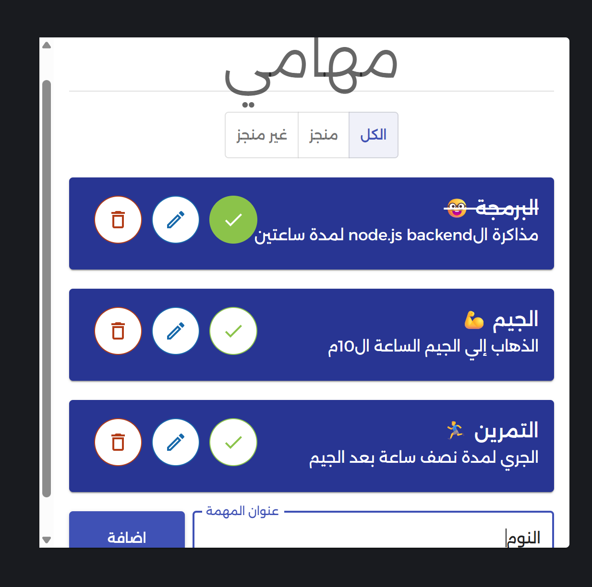

# 📝 Todo List - React.js

**Todo List** is a comprehensive task management application built to master **React.js fundamentals and advanced Hooks**. It is designed as a **Progressive Web App (PWA)**, allowing users to install it on Mobile or Desktop.

---

## 📸 Preview

[](https://todolist-do.netlify.app/)

---

## 🌐 Live Demo

🔗 [https://todolist-do.netlify.app/](https://todolist-do.netlify.app/)

---

## 📖 Project Description

A powerful yet simple Todo application that follows **CRUD** principles. It supports Arabic interface and offers a seamless user experience. Key functionalities include:

- **Add & Edit**: Create new tasks with optional detailed descriptions.
- **Manage**: Mark tasks as completed or delete them.
- **Filtering**: View all tasks, only completed tasks, or pending tasks.
- **Cross-Platform**: Can be installed as a standalone app (PWA) on Mobile and Desktop.

---

## 🎯 Project Goals (Learning Journey)

This project was a deep dive into React to implement and master:

- **State Management**: Using `useState` and `useReducer` for complex logic.
- **Global Context**: Sharing data across components using `useContext`.
- **Side Effects**: Handling life cycles with `useEffect`.
- **Performance**: Optimizing components using `useMemo`.
- **UI Design**: Implementing professional components with **Material UI (MUI)**.

---

## 🛠 Tech Stack

- **Framework**: React.js
- **UI Library**: Material UI (MUI)
- **Styling**: CSS3
- **Tools**: Progressive Web App (PWA) features, JavaScript (ES6+)

---

## ✨ Key Features

- Full CRUD operations (Create, Read, Update, Delete).
- Advanced filtering system.
- Responsive design for all screen sizes.
- Installable on devices (PWA).
- Sound effects for task interactions.

---

## 🚀 Installation & Run Locally

1. Clone the repository:

```bash
git clone https://github.com/Khodairy/todoList.git
```

2. **Navigate to the project directory:**

```bash
cd todoList
```

3. **Install dependencies:**

```bash
npm install
```

4. **Start the development server:**

```bash
npm start
```

---

## 📁 Project Structure

```text
TodoList/
├── public/                  # Static assets (icons, manifest, etc.)
├── src/                     # Main source code
│   ├── Components/          # Reusable UI components
│   │   ├── snakBar.js       # Toast notification component
│   │   ├── todoInfo.js      # Task details display
│   │   └── todoList.js      # Main list renderer
│   ├── UseContext/          # State management (Context API)
│   │   ├── toastContext.js  # Global notification context
│   │   └── todoContext.js   # Global tasks data context
│   ├── reducers/            # Complex state logic (useReducer)
│   │   └── todosReducer.js  # Logic for handling task actions (CRUD)
│   ├── App.css / index.css  # Global styles and layout
│   ├── App.js               # Root application component
│   ├── index.js             # Entry point of the application
│   ├── sound.js             # Success interaction sound
│   ├── soundFalse.js        # Error or delete interaction sound
│   └── service-worker.js    # PWA configuration for offline/installable use
├── .gitignore               # Files ignored by Git (e.g., node_modules)
├── package.json             # Project metadata and dependencies
├── package-lock.json        # Locked versions of dependencies
└── README.md                # Project documentation
```

---

## 👤 Author

**Abdallah Khodairy**

- Front-End Developer
- GitHub: [@Khodairy](https://github.com/Khodairy)
- LinkedIn: [LinkedIn](https://www.linkedin.com/in/abdallah-khodairy/)
- Portfolio: [Portfolio](https://abdallakhodairy-portfolio.netlify.app/)
